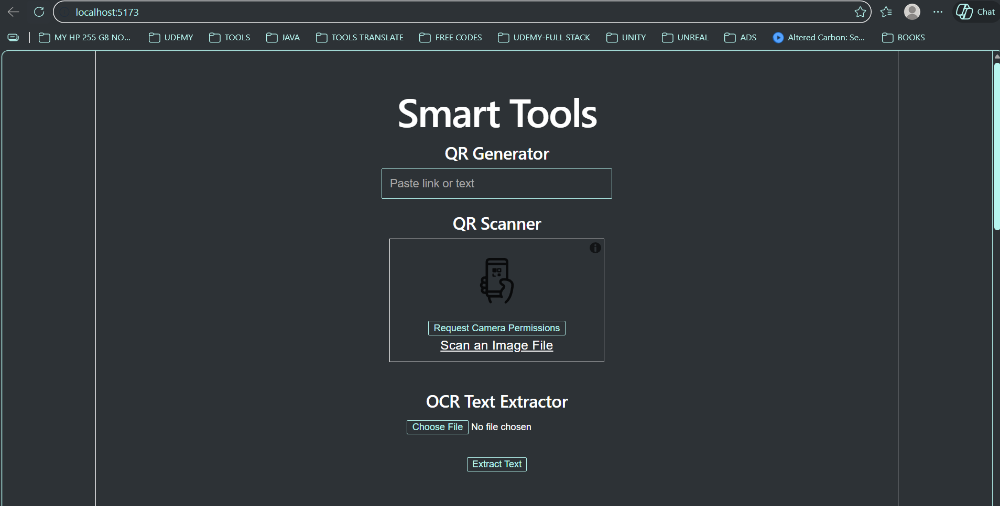
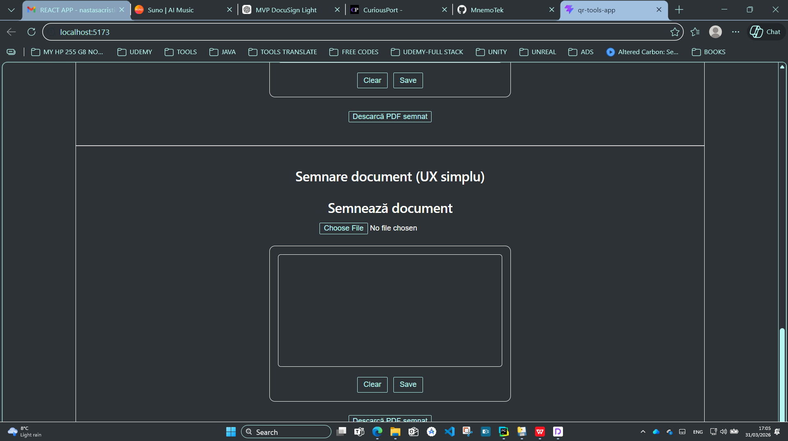
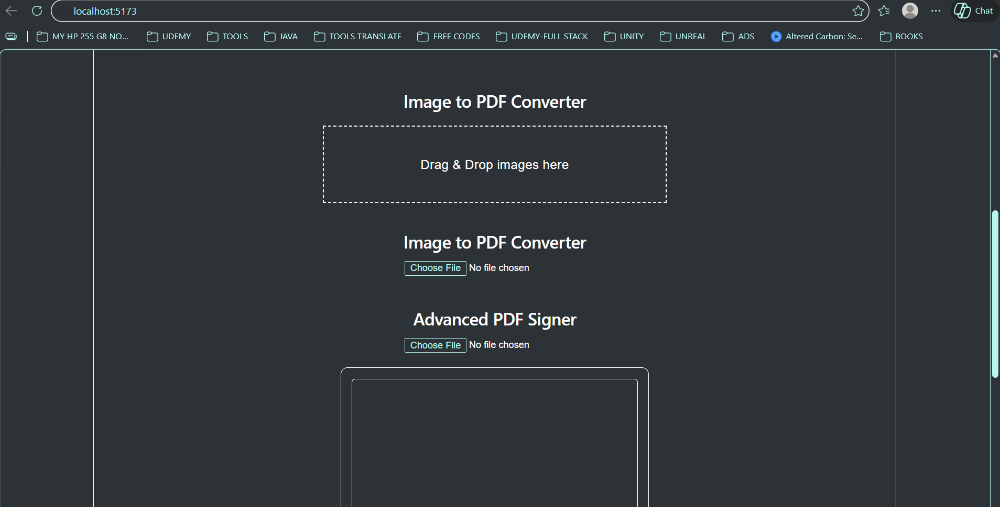
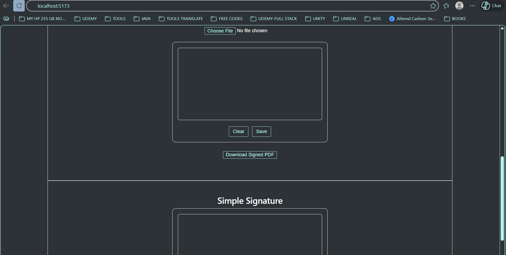
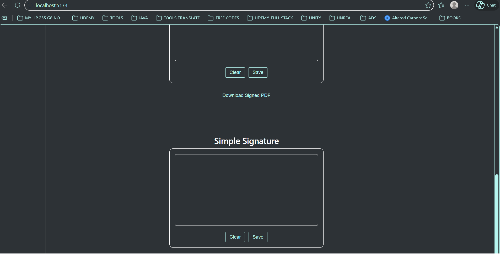

# QR Tools & Document Signing Application

## Overview

This project is a web-based platform that provides a collection of tools for working with documents, QR codes, OCR processing, and digital signatures. The application is designed to be user-friendly and accessible for non-technical users, offering a unified interface for multiple utilities.

## Features

- QR code generation
- QR code scanning
- OCR (Optical Character Recognition) for extracting text from images
- Image to PDF conversion
- Word to PDF conversion
- PDF signing with visual placement
- Drag and drop signature positioning
- Multi-page PDF support
- Client-side processing without backend dependency

## Project Structure
---src
    |   App.css
    |   App.jsx
    |   index.css
    |   main.jsx
    |   
    +---assets
    |       hero.png
    |       react.svg
    |       vite.svg
    |       
    \---components
            AdvancedPDFSigner.jsx
            ImageToPDF.jsx
            OCRExtractor.jsx
            PDFSigner.jsx
            QRGenerator.jsx
            QRScanner.jsx
            
## Application Architecture

The application is built using a modular component-based architecture in React. Each feature is implemented as an independent component and integrated into the main application through App.jsx.

The system is designed to remain scalable, allowing additional tools to be added without affecting existing functionality.

## PDF Signing Workflow

1. Upload a PDF document
2. Generate or capture a signature using the signature pad
3. Drag and position the signature on the document preview
4. Select the target page for signature placement
5. Export and download the signed PDF

## Technologies Used

- React
- Vite
- JavaScript (ES6+)
- jsPDF
- pdf-lib
- react-draggable
- HTML5 Canvas

## Setup Instructions

Install dependencies:

            RealPDFSigner.jsx
            SignaturePad.jsx
            SignDocument.jsx
            WordToPDF.jsx
          
## Deployment

The application can be deployed using platforms such as:

- Netlify
- Vercel
- GitHub Pages

## Demo

Screenshots and demo video will be provided separately.

## Notes

- All processing is performed on the client side
- No backend or server-side storage is required
- Designed for simplicity and usability for non-technical users
- Drag and drop signature placement improves user interaction for document signing

## Source Code Availability

The full source code is available upon request for investors, partners, or employers.

## Author

Cristian Nastasa  
## Screenshots

### Main Interface

### QR Generator

### OCR Extraction

### PDF Signing

### Advanced PDF Signing

## Demo Video

